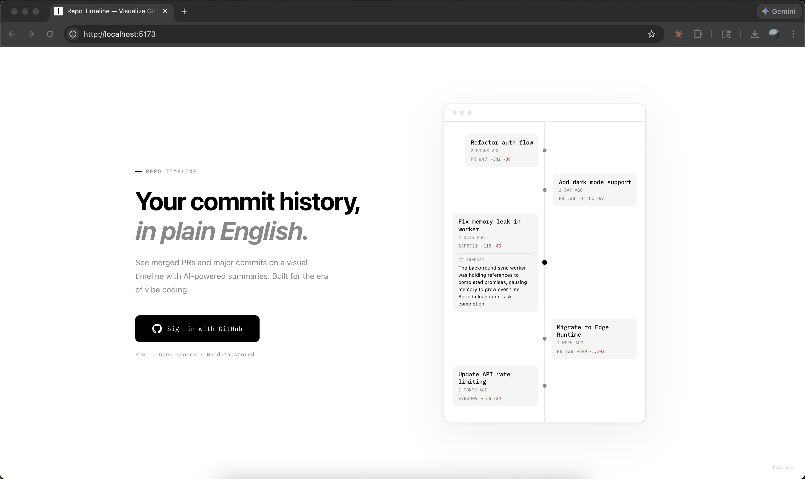

# Repo Timeline

A visual timeline of meaningful changes in a GitHub repository, explained in plain English.

<p align="center">
  
</p>

In the era of vibe coding, codebases change fast. A single session with an AI coding assistant can produce dozens of commits and PRs with thousands of lines changed. Traditional commit logs become noise.

Repo Timeline cuts through that noise. It pulls the changes that actually matter -- merged PRs and large commits -- plots them on a clean vertical timeline, and uses AI to summarize what each change did in plain language. Instead of reading diffs, you read sentences.

<p align="center">
  
</p>

## Who it's for

- Developers who use AI coding assistants (Cursor, Copilot, Claude Code) and want to understand what changed across sessions
- Engineering managers who need to follow a codebase without reading every diff
- Anyone onboarding to a new project who wants a quick history of what happened

## Features

- **Visual timeline** of merged PRs and commits with significant line changes
- **AI-powered summaries** that explain each change in 1-2 sentences of plain English
- **Any repo, any branch** -- works with public and private repositories you have access to
- **Configurable AI provider** -- bring your own: Anthropic Claude, OpenAI, or Google Gemini
- **Adjustable diff threshold** -- filter by minimum line changes (default 100)
- **Direct links** back to the original PR or commit on GitHub
- **GitHub OAuth** -- no passwords stored, no data persisted

## Running locally

Follow these steps to run Repo Timeline on your own machine.

### 1. Create a GitHub OAuth App

1. Go to [GitHub Developer Settings](https://github.com/settings/developers)
2. Click **New OAuth App**
3. Set **Homepage URL** to `http://localhost:5173`
4. Set **Authorization callback URL** to `http://localhost:3001/api/auth/callback`
5. Note your **Client ID** and generate a **Client Secret**

### 2. Configure environment

```bash
cp .env.example .env
```

Edit `.env` with your credentials:

```
GITHUB_CLIENT_ID=your_client_id
GITHUB_CLIENT_SECRET=your_client_secret
SESSION_SECRET=any-random-string
```

### 3. Configure AI summaries (optional)

The app works without AI -- you just won't see generated summaries. To enable them, pick a provider and add the corresponding API key:

| Provider | `AI_PROVIDER` | API key env var | Default model |
|----------|---------------|-----------------|---------------|
| Anthropic | `anthropic` | `ANTHROPIC_API_KEY` | `claude-haiku-4-5-20251001` |
| OpenAI | `openai` | `OPENAI_API_KEY` | `gpt-4o-mini` |
| Google Gemini | `google` | `GOOGLE_AI_API_KEY` | `gemini-2.0-flash` |

Example for OpenAI:

```
AI_PROVIDER=openai
OPENAI_API_KEY=sk-...
```

You can also override the model with `AI_MODEL=your-preferred-model`.

### 4. Install and run

```bash
npm install
npm start
```

This starts both the Vite dev server (`:5173`) and the Express backend (`:3001`). Open `http://localhost:5173`, sign in with GitHub, and select a repo.

## Deploying to Vercel

To deploy Repo Timeline to production, you can host it on Vercel. The `api/` directory contains Edge Functions that replace the Express server in production.

1. Push to GitHub and import the repo in [Vercel](https://vercel.com)
2. Add environment variables in your Vercel project settings:
   - `GITHUB_CLIENT_ID`
   - `GITHUB_CLIENT_SECRET`
   - `SESSION_SECRET`
   - `APP_URL` (e.g. `https://your-app.vercel.app`)
   - `AI_PROVIDER` and the corresponding API key
3. Update your GitHub OAuth App's callback URL to `https://your-app.vercel.app/api/auth/callback`

## Stack

- **Frontend**: React + TypeScript + Vite
- **Backend**: Express (local dev) / Vercel Edge Functions (production)
- **Auth**: GitHub OAuth with JWT sessions
- **AI**: Anthropic Claude, OpenAI, or Google Gemini (configurable)
- **Styling**: Custom CSS, IBM Plex Mono, minimal black-and-white aesthetic

## Contributing

Contributions are welcome. Fork the repo, create a branch, and open a PR.

## License

[MIT](LICENSE)
